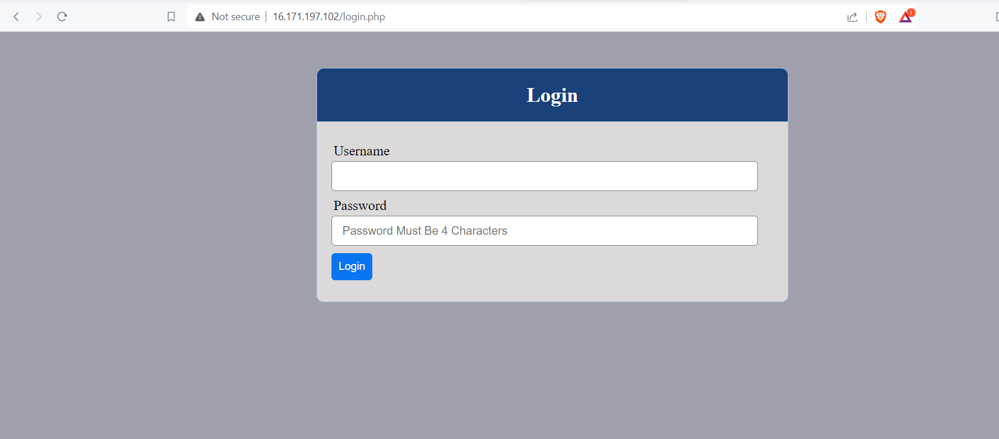
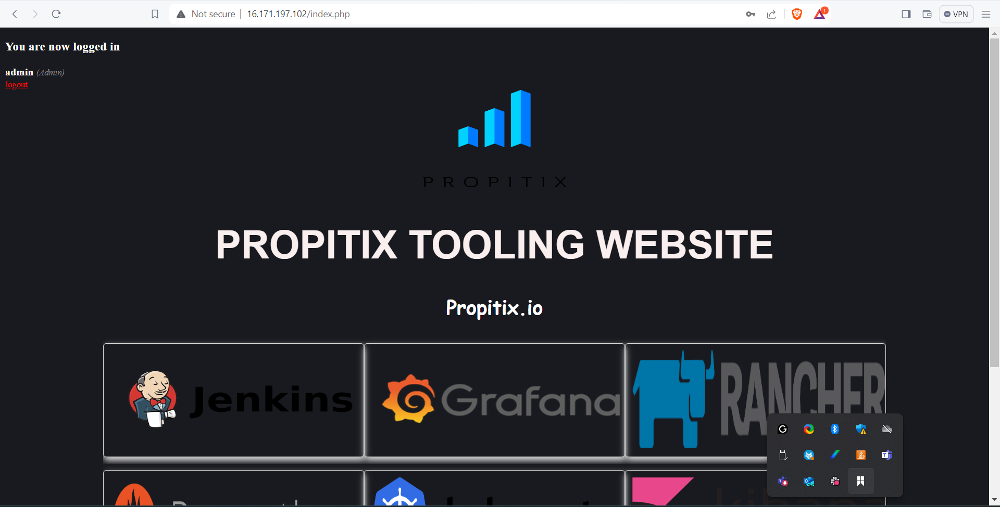
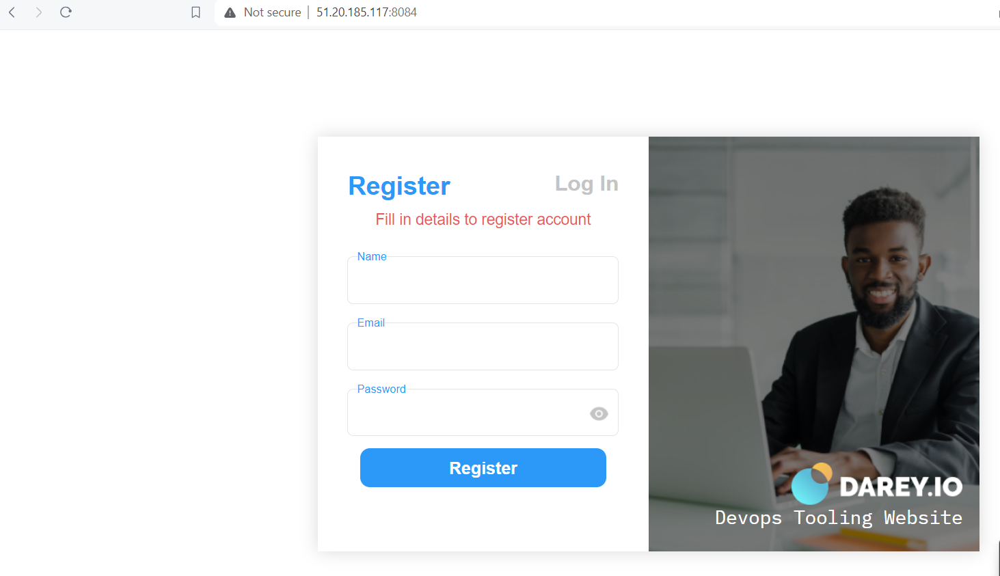
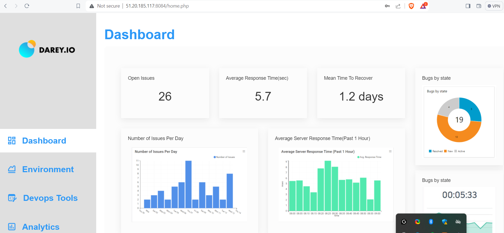

# DEPLOY A PHP 2-TIER WEB APPLICATION ON AWS PLATFORM USING IaaS

*This is a documentation page that guide us through the manual (Application installations and configuration is automated with bash script) deployment process of a PHP 2-tier (tooling website) apllication locally using VAGRANT on AWS platform*

This same project was implemented on our local data center managed with vagrant power with virtual box, the full documentation is [here](https://github.com/nbomasi/PHP-APPLICATION-DEPLOYMENT.git)

### Design-on-AWS-platform

PROJECT EXECUTION FLOW

1. Login to AWS Account
2. Create Key Pairs
3. Create Security Groups
4. Lauch instances with user data (Bash scripts)

## Infractructures:

1. EC2 instance (Redhat9) for apache webserver
2. EC2 instance (Redhat9) for DB server

## Create Security Groups
* Security group for webserver, port 80 and 8084 was opened
* Backend: Mysql (3306) opened to allow web server security group

## Lauch instances with user data (Bash scripts)

* **Database:** Find the bash script for Database installation and configuration [here](mysql.sh)
* **Apache webserver:** Here we have 2 websites to host on the same webserver, since we are not interested in route 53 service.We use a static IP
    * I decide to use Apache virtual hosting to host the 2 websites
    * Then I configured apache to listen on both port 80 and 8084 so that each of this sites could be served on different ports.
    * Apache installation, configurations and virtual hosting configuration script are  [here](virtual-host.sh)
* Each of these script was uploaded to AWS ec2 instance user data during creation of the instances.

Find the websites below after deployment.

**Website view on port 80 (site 1)**

**Website view on port 8084 (site 2)**

